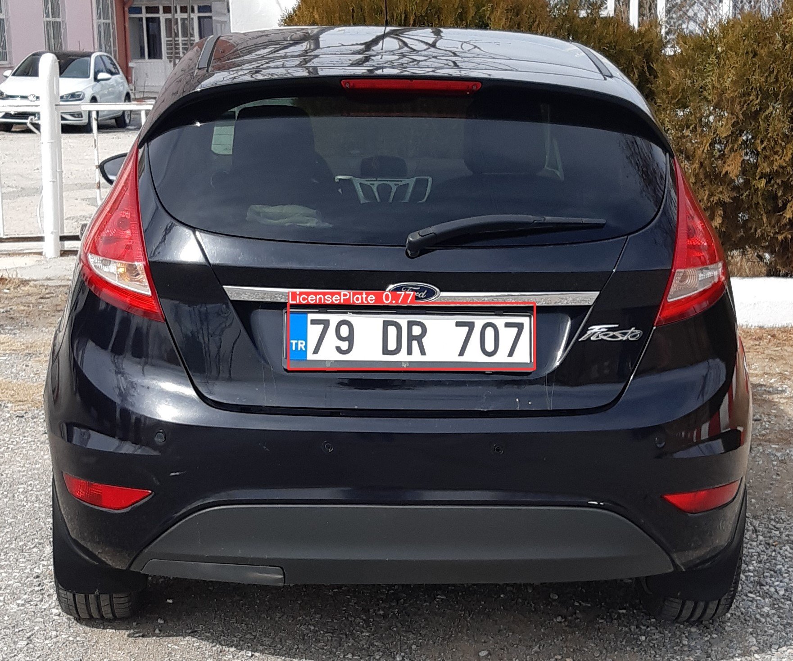
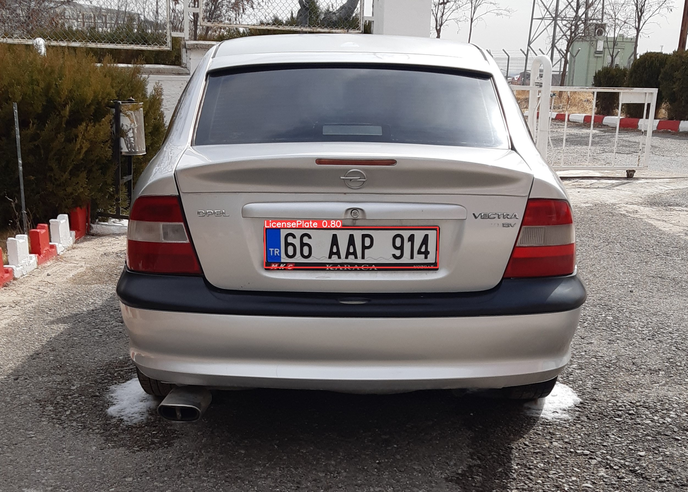

# License Plate Detection Model using YoloV8

## Overview

This project is focused on developing a machine learning model using the YoloV8 library to detect and locate car license plates from images and videos. License plate detection is crucial in many fields, including security, traffic monitoring, and automated toll systems. By leveraging deep learning, machine learning, and image processing techniques, this model can efficiently and accurately identify license plates, making it a powerful tool for real-time applications.

## Table of Contents

- [Features](#features)
- [Technologies Used](#technologies-used)
- [Installation](#installation)
- [Dataset](#dataset)
- [Model Training](#model-training)
- [Inference](#inference)
- [Example Outputs](#example-outputs)
- [How It Works](#how-it-works)
- [Performance](#performance)
- [Future Work](#future-work)
- [License](#license)
- [Contact](#contact)

## Features

- **Real-time Detection:** The model can detect license plates in real-time from video streams or images.
- **High Accuracy:** Utilizes advanced deep learning techniques for precise detection.
- **Scalable:** Can be adapted to different environments and camera setups.
- **Easy Integration:** The codebase is designed to be easily integrated into existing systems.

## Technologies Used

- **Deep Learning:** Utilizes Convolutional Neural Networks (CNNs) for feature extraction and prediction.
- **YOLOv8:** The latest version of the You Only Look Once (YOLO) architecture, known for its speed and accuracy.
- **OpenCV:** Used for image processing tasks, such as reading images and drawing bounding boxes.
- **Python:** The primary programming language used for this project.
- **PyTorch:** The deep learning framework used to build and train the model.

## Installation

To get started with the project, you'll need to clone the repository and install the necessary dependencies:

```bash
git clone https://github.com/yourusername/license-plate-detection.git
cd license-plate-detection
pip install -r requirements.txt
```

Ensure that you have Python 3.7 or higher installed on your system.

## Dataset

The model is trained on a comprehensive dataset consisting of images of cars with visible license plates. The dataset includes various conditions, such as different lighting and weather scenarios, to ensure robustness. Each image is annotated with bounding boxes indicating the position of the license plates.

### Example Data Structure

```plaintext
dataset/
    ├── images/
    │   ├── image1.jpg
    │   ├── image2.jpg
    │   └── ...
    ├── labels/
    │   ├── image1.txt
    │   ├── image2.txt
    │   └── ...
    └── data.yaml
```

- **Images Directory:** Contains all the images used for training and validation.
- **Labels Directory:** Contains annotation files for each image, with bounding box coordinates for the license plates.
- **data.yaml File:** Defines the dataset configuration, including paths and class names.

### Label Format

The label files contain annotations in the YOLO format:

```plaintext
<class_id> <x_center> <y_center> <width> <height>
```

- `class_id`: The class identifier for the license plate.
- `x_center`, `y_center`: The normalized center coordinates of the bounding box.
- `width`, `height`: The normalized width and height of the bounding box.

### Sample Annotation

```plaintext
0 0.459 0.474 0.122 0.394
```

## Model Training

The model is trained using the YoloV8 architecture, which provides a balance between speed and accuracy. Training involves several key steps, including data preprocessing, model initialization, training loop, and validation.

### Steps for Training

1. **Preprocessing:** Images are resized and normalized to fit the model's input requirements.
2. **Data Augmentation:** Techniques such as rotation, scaling, and flipping are applied to increase dataset variability.
3. **Model Initialization:** The YoloV8 model is initialized with pre-trained weights for faster convergence.
4. **Training Loop:** The model learns to predict bounding boxes and class probabilities through iterative updates.
5. **Validation:** The model's performance is evaluated on a separate validation set to monitor accuracy and loss.

### Command to Train the Model

```bash
python train.py --data data.yaml --cfg yolov8.yaml --weights yolov8.pt --epochs 50 --img-size 640
```

- `data.yaml`: Path to the dataset configuration file.
- `yolov8.yaml`: Model configuration file.
- `yolov8.pt`: Pre-trained weights for the model.
- `epochs`: Number of training epochs.
- `img-size`: Input image size for the model.

## Inference

Once the model is trained, it can be used for inference on new images or videos. The inference script processes input files and outputs the detected license plates with bounding boxes.

### Running Inference

```bash
python detect.py --weights best.pt --source test_images/ --conf-thres 0.5 --iou-thres 0.4
```

- `best.pt`: Path to the trained model weights.
- `test_images/`: Directory containing test images or videos.
- `conf-thres`: Confidence threshold for detections.
- `iou-thres`: Intersection over Union threshold for non-max suppression.

## Example Outputs

Here are some examples of the model's output on test images:

### Example 1



### Example 2

**Input Image:**



## How It Works

The model works by processing each frame of a video or image to detect license plates. The YoloV8 architecture utilizes a single neural network to predict bounding boxes and class probabilities simultaneously, making it extremely efficient.

### Key Components

1. **Feature Extraction:** The initial layers of the network extract features from the input image using convolutional operations.
2. **Bounding Box Prediction:** The network predicts bounding boxes around potential license plates, each with associated confidence scores.
3. **Non-Max Suppression:** Overlapping boxes are filtered using IoU thresholds to ensure only the best detections remain.
4. **Class Prediction:** The network assigns class probabilities to each detected box, identifying it as a license plate.

### Architecture Overview

```plaintext
Input Image -> Convolutional Layers -> Feature Maps -> Bounding Box Prediction -> Non-Max Suppression -> Detected License Plates
```

### Processing Pipeline

1. **Input:** Image or video frame is fed into the model.
2. **Detection:** Model processes the input to detect and localize license plates.
3. **Output:** Detected plates are highlighted with bounding boxes and displayed.

## Performance

The model's performance is evaluated on a validation dataset, with metrics such as mean Average Precision (mAP) and Intersection over Union (IoU) used to assess accuracy.

- **mAP:** Measures the model's ability to detect objects correctly across various thresholds.
- **IoU:** Evaluates the overlap between predicted and ground-truth bounding boxes.

### Performance Metrics

| Metric         | Value  |
|----------------|--------|
| mAP@0.5        | 92.3%  |
| IoU            | 0.78   |
| Inference Time | 12 ms  |

### Performance Graphs

**mAP over Epochs:**


**Loss over Epochs:**


## Future Work

- **Improved Accuracy:** Further fine-tuning and experimentation with hyperparameters to improve detection accuracy.
- **Multi-Scale Detection:** Incorporating multi-scale detection techniques for better performance on smaller plates.
- **Real-World Testing:** Deploying the model in real-world scenarios for additional testing and optimization.
- **Integration with OCR:** Developing an Optical Character Recognition (OCR) module to read detected license plate numbers.
- **Cross-Domain Application:** Expanding the model's applicability to different types of vehicles and environments.

## License

This project is licensed under the MIT License - see the [LICENSE](LICENSE) file for details.

## Contact

For questions, comments, or suggestions, feel free to reach out:

- **Name:** Görkem Turkut
- **Email:** gorkemturkut@hotmail.com
- **GitHub:** [gorkemturkut57](https://github.com/gorkemturkut57)

---
